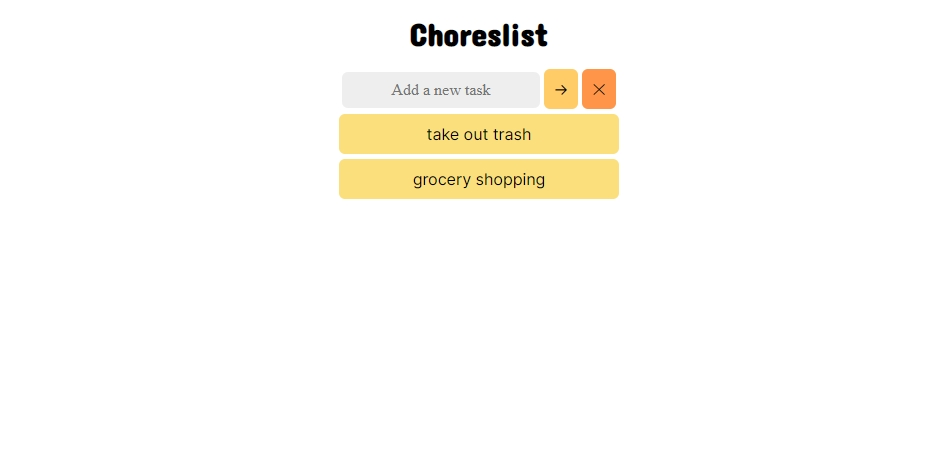

# Choreslist

Choreslist is a simple and easy-to-use web app that allows you to manage your tasks effectively. Keep track of your chores by adding and deleting tasks in a straightforward and intuitive interface.

## Features

- Add new tasks to your list
- Delete tasks individually
- Clear the entire list

## Installation

No installation is required. Simply open the `index.html` file in your preferred web browser to start using Choreslist.

## Usage

1. Open `index.html` in your web browser.
2. Add a new task by typing the task description in the input box and clicking the "->" button.
3. To delete a task, click on the task in the list.
4. To clear the entire list, click on the "✕" button.
